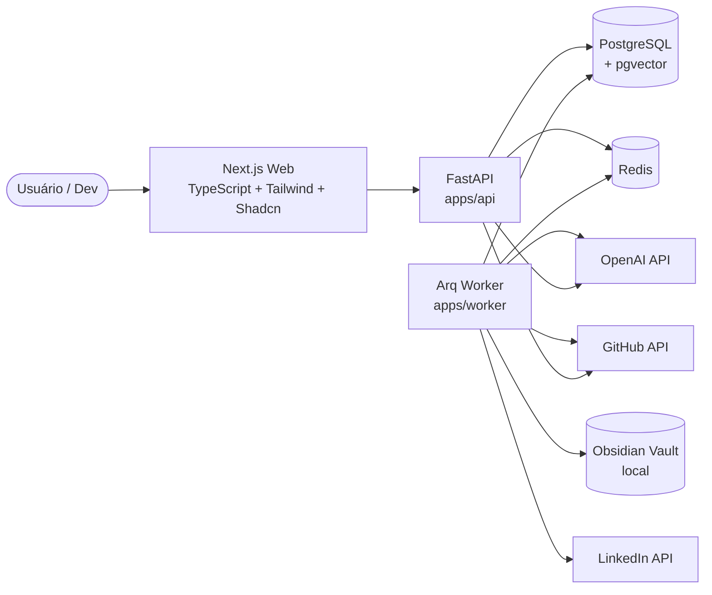
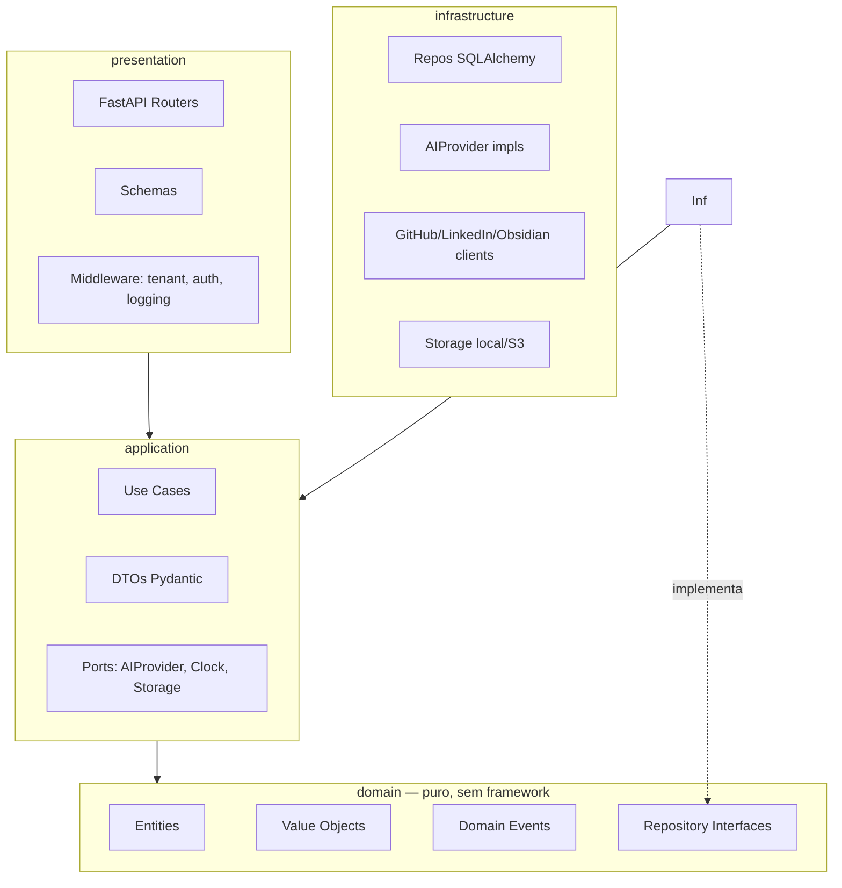
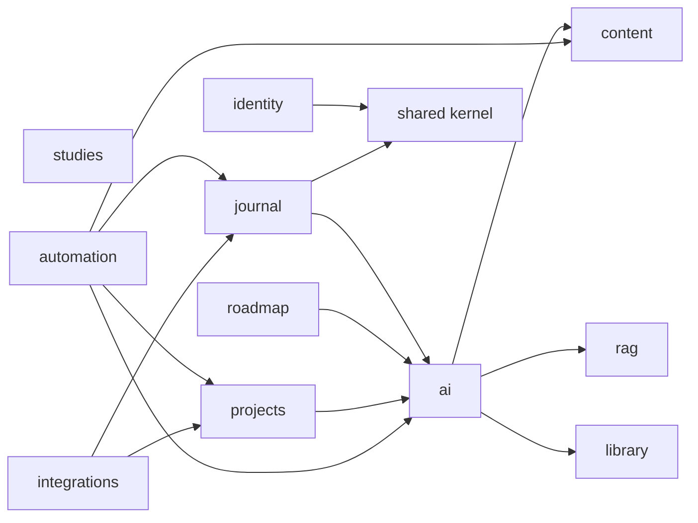
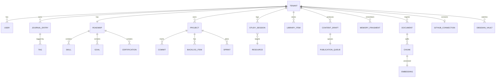
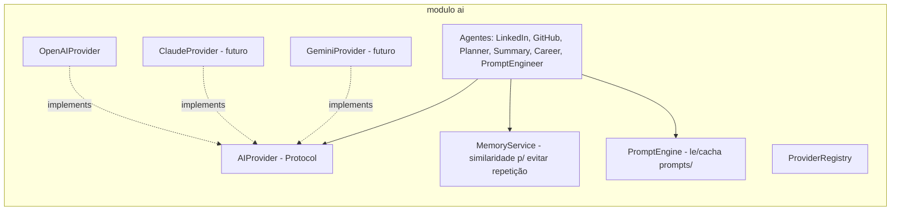

# Arquitetura — Developer Brain AI

> Decisões em `docs/adr/`. Resumo executivo das ADRs em `docs/adr/README.md`.

## 1. Visão C4 — Nível Container (contexto)



## 2. Clean Architecture (por bounded context)



**Regra:** dependências apontam sempre para dentro (`domain`): nenhum `import` de domínio
para SQLAlchemy/FastAPI/OpenAI. Testes de arquitetura proíbem esse direction.

## 3. Bounded Contexts



## 4. Modelo de domínio (resumo ER)



Multi-tenancy: TODAS as tabelas de domínio carregam `tenant_id UUID NOT NULL`; RLS do
Postgres filtra por `app.tenant_id` (SET no início da transação via UoW).

## 5. Pipeline diário (automação)

```mermaid
flowchart TB
    A[Job diário Arq] --> B[Ler diários novos]
    B --> C[Atualizar banco + tags]
    C --> D[Summary Agent: resumo diário/semanal]
    D --> E[LinkedIn Agent: gerar post]
    D --> F[GitHub Agent: atualizar README/badges]
    D --> G[Newsletter + Cards]
    E --> H[Fila de publicação]
    F --> I[Commit no repo]
    G --> H
    H --> J[Atualizar Dashboard]
    J --> K[Salvar histórico + MemoryFragment]
    K --> L[Fim (idempotente por data)]
```

Cada step é um **use_case idempotente**; re-rodar o job no mesmo dia não duplica
conteúdo (dedupe via chave composta `tenant_id + pipeline_date + step_name`).

## 6. Camada de IA



## 7. Roadmap de fases

| Fase | Entrega | Definição de pronto |
|------|---------|---------------------|
| 0 | Scaffolding monorepo + tooling + containers + ADRs | `make dev`, CI verde |
| 1 | Bounded contexts vazios + interfaces + diagramas | testes de arquitetura passam |
| 2 | `shared` kernel (auth, errors, UoW, tenant) | cobertura ≥90% |
| 3 | Módulo Journal (CRUD + Markdown) | testes end-to-end verde |
| 4 | Roadmap, Projects, Studies, Library | um PR por módulo |
| 5 | `AIProvider` abstraction + OpenAI + PromptEngineer | troca de provider por config |
| 6 | Agentes (LinkedIn, GitHub, Planner, Summary, Career) | um agente por PR |
| 7 | Automation: Arq worker + pipeline diário idempotente | job re-entrante |
| 8 | RAG: ingestão + retrieval (pgvector) | QA sobre a própria base |
| 9 | Integrations: GitHub, Obsidian, LinkedIn (drafts) | ACL isolada |
| 10 | Dashboard + Next.js frontend | API pública estável |
| 11 | Observabilidade (structlog, OpenTelemetry, Sentry-ready) | tracing ponta-a-ponta |
| 12 | SaaS-ready (billing-ready, S3 storage, multi-tenant já ativo) | isolamento validado |